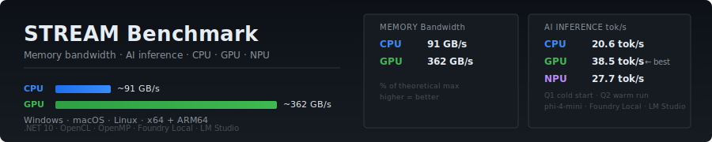
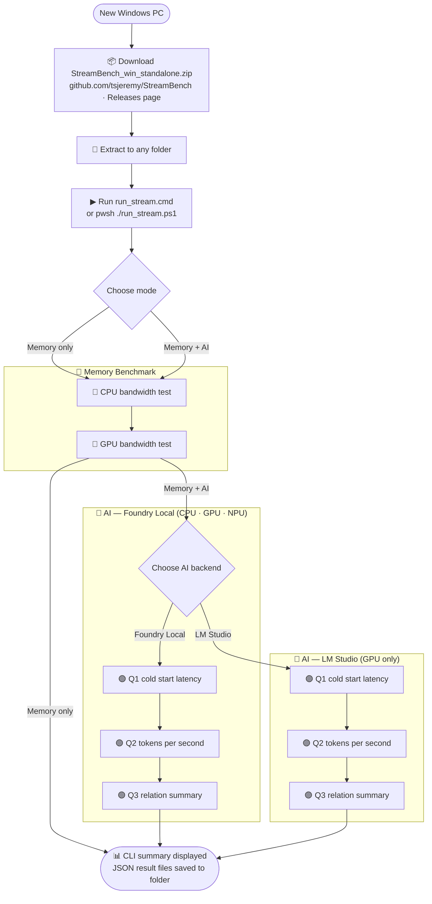
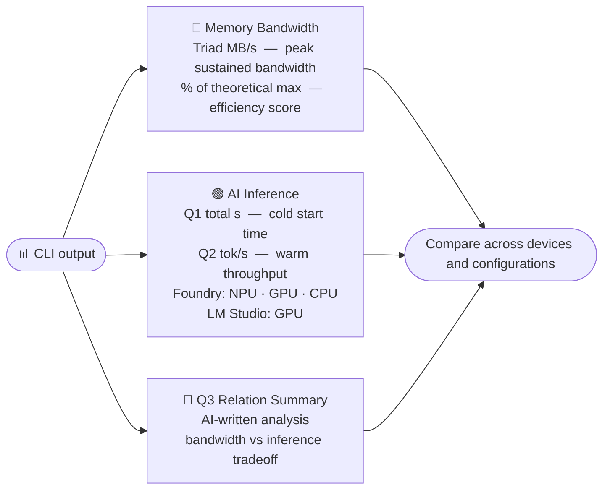

<p align="center">
  
</p>

# STREAM Memory Bandwidth Benchmark

A cross-platform **memory bandwidth benchmark** with both **CPU** and **GPU** versions, based on the
industry-standard [STREAM benchmark](http://www.cs.virginia.edu/stream/ref.html) by John D. McCalpin.
Also includes an **AI inference benchmark** supporting [Microsoft AI Foundry Local](https://learn.microsoft.com/en-us/azure/ai-foundry/foundry-local/) and [LM Studio](https://lmstudio.ai) to measure LLM response time and tokens/second on CPU, GPU, and NPU.

## Architecture

| Component | Technology | Role |
|-----------|-----------|------|
| `stream.c` | C + OpenMP | CPU memory bandwidth kernels (headless backend, outputs JSON) |
| `stream_gpu.c` | C + OpenCL | GPU memory bandwidth kernels (headless backend, outputs JSON) |
| `StreamBench/` | .NET 10 | User-facing CLI — colored output, JSON/CSV saving, AI inference benchmark |

The C backends run the performance-critical kernels and output raw JSON to stdout.
The **StreamBench** .NET app is the primary entry point — it launches the C backend,
displays color-formatted results, saves files, and runs the AI inference benchmark.

```
  User -> StreamBench (.NET 10) -> stream_cpu / stream_gpu (C)
                                        | JSON on stdout
                        <- display colored table, save .csv / .json

  User -> StreamBench (.NET 10) --ai -> AI Backend (Foundry Local or LM Studio)
                                        | runs SLM on CPU / GPU / NPU
                        <- display inference timing, tokens/sec, save .json
```

---

## Download & Run (Pre-built Binaries — No Build Required)

Pre-built binaries for **Windows** and **macOS** (x64 + ARM64) are available on the
[Releases page](https://github.com/tsjeremy/StreamBench/releases/tag/v5.10.29).
No compiler, .NET SDK, or build tools needed — just download and run.

Each `StreamBench` binary has the CPU and GPU benchmark engines **embedded inside**,
so you only need a single download. The benchmarks still run as native C code for
maximum performance — StreamBench extracts them automatically on first run.

> **Windows users**: A standalone **zip package** (`StreamBench_v5.10.29_win_standalone.zip`)
> is also available — download one file, extract, and run. Includes setup script,
> launcher scripts, and all four Windows executables (standard + AI-enabled).

### Setup & run flow



### Windows — Standalone ZIP (recommended)

1. Go to the **[v5.10.29 Release](https://github.com/tsjeremy/StreamBench/releases/tag/v5.10.29)**
2. Download **`StreamBench_v5.10.29_win_standalone.zip`**
3. Extract to any folder and run the recommended Windows entrypoint:

```cmd
run_stream.cmd
```

This opens a simple launcher where you can choose:

- **Memory benchmark only**
- **Memory benchmark + AI benchmark**

If you choose AI mode, the launcher also prompts for the backend:

- **Auto-detect**
- **LM Studio**
- **Foundry Local**

Each launcher-driven run also writes a full CLI transcript beside the launcher,
for example `StreamBench_cli_20260314_221646.log`.

If prerequisites are missing, the launcher automatically runs `setup.ps1` first.

Optional manual / advanced path:

```powershell
# Explicit first-time setup (optional)
.\setup.ps1

# Same unified launcher inside PowerShell
.\run_stream.ps1

# Compatibility shortcut that preselects AI mode
.\run_stream_ai.ps1
```

### Windows — Individual exe download

1. Go to the **[v5.10.29 Release](https://github.com/tsjeremy/StreamBench/releases/tag/v5.10.29)**
2. Download the exe for your architecture:

| File | Description |
|------|-------------|
| `StreamBench_win_x64.exe` | Memory benchmark only (x64) |
| `StreamBench_win_arm64.exe` | Memory benchmark only (ARM64) |
| `StreamBench_win_x64_ai.exe` | Memory + AI benchmark (x64) |
| `StreamBench_win_arm64_ai.exe` | Memory + AI benchmark (ARM64) |

3. Run it:

```powershell
# CPU benchmark
.\StreamBench_win_x64.exe --cpu

# GPU benchmark
.\StreamBench_win_x64.exe --gpu

# AI inference benchmark (requires AI-enabled exe + Foundry Local or LM Studio)
# The _ai binary auto-runs memory (CPU/GPU) + AI (CPU/GPU/NPU) with no flags needed:
.\StreamBench_win_x64_ai.exe

# Or specify devices explicitly:
.\StreamBench_win_x64_ai.exe --ai --ai-device cpu,gpu
```

> **ARM64 Windows users:** Use `*_arm64*` variants instead.

#### One-liner PowerShell (copy-paste)

```powershell
Invoke-WebRequest "https://github.com/tsjeremy/StreamBench/releases/download/v5.10.29/StreamBench_win_x64.exe" -OutFile StreamBench.exe; .\StreamBench.exe --cpu
```

### macOS — Download and run

1. Go to the **[v5.10.29 Release](https://github.com/tsjeremy/StreamBench/releases/tag/v5.10.29)**
2. Download **`StreamBench_osx-arm64`** (ARM64) or **`StreamBench_osx-x64`** (x64)
3. Run it:

```bash
chmod +x StreamBench_osx-arm64
./StreamBench_osx-arm64 --cpu
./StreamBench_osx-arm64 --gpu
```

#### One-liner bash (copy-paste into Terminal)

```bash
curl -fLO https://github.com/tsjeremy/StreamBench/releases/download/v5.10.29/StreamBench_osx-arm64 && chmod +x StreamBench_osx-arm64 && ./StreamBench_osx-arm64 --cpu
```

### Using the launcher scripts (alternative)

The launcher files are available as separate downloads on the
[release page](https://github.com/tsjeremy/StreamBench/releases/tag/v5.10.29).

- **`setup.ps1`**: optional first-time setup — installs VC++ Redistributable, .NET 10 Runtime, PowerShell 7, and AI backends (Foundry Local and/or LM Studio) — all silent via winget; standalone mode auto-detected
- **`run_stream.cmd`**: recommended Windows launcher — automatically uses PowerShell bypass, lets you choose memory-only or memory + AI, prompts for AI backend when needed, and saves a full CLI transcript
- **`run_stream.ps1`**: unified PowerShell launcher for Windows, macOS, and Linux — **auto-runs `setup.ps1`** on Windows if prerequisites are missing and saves a full CLI transcript
- **`run_stream_ai.cmd`**: Windows compatibility shortcut that preselects AI mode and automatically uses PowerShell bypass
- **`run_stream_ai.ps1`**: compatibility shortcut that forwards into the unified launcher with AI mode preselected

Download the script(s) alongside the `StreamBench_*` binary and run:

- **Windows**:
  ```cmd
  rem Recommended: unified launcher + automatic execution-policy bypass
  run_stream.cmd

  rem Compatibility AI shortcut
  run_stream_ai.cmd
  ```

  ```powershell
  # Same unified launcher inside PowerShell
  .\run_stream.ps1

  # Compatibility AI shortcut
  .\run_stream_ai.ps1

  # Fallback if you prefer to invoke the script explicitly with bypass
  pwsh -ExecutionPolicy Bypass -File .\run_stream.ps1
  ```
- **macOS/Linux**: `pwsh ./run_stream.ps1` (choose mode) or `pwsh ./run_stream_ai.ps1` (compatibility AI shortcut)

Launcher environment overrides:

```powershell
# Override default 200M array size for both launchers
$env:STREAMBENCH_ARRAY_SIZE = "100000000"

# Preselect launcher mode without prompting (advanced / automation)
$env:STREAMBENCH_LAUNCH_MODE = "ai"

# Optional AI launcher overrides (applied when AI mode is selected)
$env:STREAMBENCH_AI_BACKEND = "lmstudio"  # auto, lmstudio, foundry
$env:STREAMBENCH_AI_MODEL = "phi-4-mini"
$env:STREAMBENCH_AI_DEVICES = "cpu,npu"   # if unset, all detected devices are used
$env:STREAMBENCH_AI_NO_DOWNLOAD = "1"     # cached models only
```

When running from source (`StreamBench.csproj`) instead of a standalone package,
the launcher expects local native backends (`stream_cpu_*`, `stream_gpu_*`) for
the memory benchmark. If they are not built yet, the launcher now warns clearly
and continues with **AI-only mode** so local backend validation can still run.
Q3 still requires at least one saved `stream_*_results_*.json` file.

### Standalone C backend binaries (advanced)

The individual C backend binaries (`stream_cpu_*`, `stream_gpu_*`) are also available on the
release page for users who want to run them directly without the StreamBench frontend:

```bash
# Run C backend directly (outputs raw JSON to stdout)
./stream_cpu_macos_arm64 --array-size 200000000
./stream_gpu_win_x64.exe --array-size 200000000
```

---

## Build from Source

> Building from source? See **[BUILDING.md](BUILDING.md)** for prerequisites, compiler setup, build scripts, and step-by-step compilation guides for Windows, macOS, and Linux.

---

## AI Inference Benchmark (`--ai`)

StreamBench includes an AI inference benchmark supporting two backends:

- **[Microsoft AI Foundry Local](https://learn.microsoft.com/en-us/azure/ai-foundry/foundry-local/)** — runs SLMs with hardware-specific optimization (CPU, GPU, NPU) on Windows and macOS
- **[LM Studio](https://lmstudio.ai)** — cross-platform (Windows, macOS, Linux) GPU/CPU inference via llama.cpp

| Backend | CPU | GPU | NPU |
|---------|-----|-----|-----|
| Microsoft Foundry Local | ✅ | ✅ | ✅ (Windows, NPU via OpenVINO) |
| LM Studio (llama.cpp) | ✅ | ✅ | ❌ (llama.cpp has no NPU backend) |

> **NPU benchmarking requires Microsoft Foundry Local.** LM Studio uses llama.cpp which has no NPU/DirectML-NPU support on Windows.

Both backends expose OpenAI-compatible REST APIs. StreamBench uses a lightweight `DirectOpenAiChatClient` (custom `IChatClient` implementation) to avoid compatibility issues with SDK response parsing from local backends.

### What it measures

| Metric | Description |
|--------|-------------|
| **Model load time** | Time to load the model into device memory (one-time cost) |
| **Q1 response time** | Time for the first inference — "Hello World!" |
| **Q1 total time** | Model load + Q1 response (what a cold-start user experiences) |
| **Q2 response time** | Time for the second inference — "How to calculate memory bandwidth on different memory?" |
| **Q2 Tokens/second** | **Key metric** — output throughput with model already loaded (warm run) |

> **Why Q2 tokens/second is the key metric:** once the model is loaded, inference is *memory-bandwidth limited* — the bottleneck is how fast the hardware can stream model weights from RAM/VRAM/NPU memory into the compute units. A device with higher memory bandwidth produces higher tokens/second. This is why CPU, GPU, and NPU with the *same memory bandwidth* (e.g., unified LPDDR5X on a laptop SoC) tend to produce similar Q2 tok/s even with very different compute architectures.

The benchmark runs Q1 immediately after model loading (cold run), then Q2 with the model
already resident in memory (warm run). This lets you compare cold-start latency with
sustained inference throughput across CPU, GPU, and NPU.

### Prerequisites

Install at least one AI backend. The `setup.ps1` script auto-installs these when
you choose the AI benchmark, but you can also install them manually:

**Microsoft Foundry Local (Windows/macOS):**

```powershell
# Windows
winget install Microsoft.FoundryLocal
```

```bash
# macOS
brew tap microsoft/foundrylocal && brew install foundrylocal
```

**LM Studio (Windows/macOS/Linux):**

```powershell
# Windows
winget install ElementLabs.LMStudio
```

```bash
# macOS
brew install --cask lm-studio
```

Then open LM Studio, download a model (e.g. phi-3.5-mini-instruct GGUF), and **load it into the server before running StreamBench** (LM Studio → Developer tab → Load a model).

> ⚠️ **LM Studio does not support NPU.** It uses llama.cpp which has no NPU backend. For NPU benchmarking use Foundry Local instead.

### Running the AI benchmark

```powershell
# Memory-only default (CPU + GPU)
.\StreamBench.exe                                   # Windows
./StreamBench_osx-arm64                             # macOS

# Add AI benchmark on all available AI devices (CPU/GPU/NPU)
.\StreamBench.exe --ai                              # Windows
./StreamBench_osx-arm64 --ai                        # macOS

# Benchmark specific devices
.\StreamBench.exe --ai --ai-device cpu,gpu

# Use a specific model
.\StreamBench.exe --ai --ai-model phi-3.5-mini

# Select AI backend explicitly
.\StreamBench.exe --ai --ai-backend lmstudio
.\StreamBench.exe --ai --ai-backend foundry

# Run AI only (skip default CPU/GPU memory passes)
.\StreamBench.exe --ai-only

# Auto-detect best available backend (default)
.\StreamBench.exe --ai --ai-backend auto

# Quick mode — cached models only, skip shared pass, 1 model/device (CI/automated)
.\StreamBench.exe --ai --quick-ai

# Shared-model comparison only (skip best-per-device pass)
.\StreamBench.exe --ai --ai-shared-only

# Use only cached models (no downloads)
.\StreamBench.exe --ai --ai-no-download

# Don't save the JSON result file
.\StreamBench.exe --ai --no-save
```

StreamBench prints full Q1/Q2 answers and, when memory JSON exists, also runs
relation questions (Q3 and future Q4/Q5...) on each selected AI device.
All relation questions use the same question output style and the same
latency/tokens-per-second reporting method.

When Q3 runs, the main `ai_inference_benchmark_*.json` file now embeds
`ai_relation_summary` so Q1/Q2/Q3 live together in one artifact, while
`ai_relation_summary_*.json` is still saved separately for direct inspection.

When benchmarking multiple devices together, StreamBench chooses shared model aliases
by this order:

1. Highest selected-device coverage (CPU/GPU/NPU variants available)
2. Most cached variants for the selected devices
3. Internal shared-priority list (ordered by real-world download + inference speed)

The shared pass is capped at **5 model attempts** and a **10-minute time budget**
to prevent runaway loops. When cached models are available, the shared pass
skips downloads and uses cached models first. If the Foundry service crashes
(2 consecutive failures), StreamBench automatically restarts it once before
falling back to per-device defaults.

If no alias covers all selected devices, StreamBench automatically falls back to
the best partial coverage and then runs best-per-device comparison pass.

If GPU or NPU models are not available in the current backend catalog,
StreamBench removes those devices from the active pass automatically and
continues with the devices that do have compatible models.

For single-device runs, StreamBench uses device-specific priority lists and prefers
cached models first to reduce download/startup time.

### Example output — Foundry Local (CPU / GPU / NPU)

```
══════════════════════════════════════════════════════════════
  AI Inference Benchmark — Foundry Local
══════════════════════════════════════════════════════════════
  Q1 (cold): Hello World!
  Q2 (warm): How to calculate memory bandwidth on different memory?
  Q3 (relation): Summarize local memory bandwidth and AI benchmark results from saved JSON files.

── AI Benchmark: CPU (phi-4-mini-instruct-generic-cpu) ──

╭──────────────────────── Model Info ────────────────────────╮
│ Property               │ Value                             │
├────────────────────────┼───────────────────────────────────┤
│ Device                 │ CPU                               │
│ Model ID               │ phi-4-mini-instruct-generic-cpu   │
│ Alias                  │ phi-4-mini                        │
╰────────────────────────┴───────────────────────────────────╯
╭──────────────────────────────────────────── Inference Timing ────────────────────────────────────────────╮
│ Run                        │   Model Load (s) │   Response (s) │   Total (s) │   Tokens Out │   Tok/sec│
├────────────────────────────┼──────────────────┼────────────────┼─────────────┼──────────────┼────────────┤
│ Q1 (cold, incl. load)      │          151.036 │          3.226 │     154.262 │           95 │       29.5 │
│ Q2 (warm)                │                — │         27.554 │      27.554 │          567 │       20.6 │
╰────────────────────────────┴──────────────────┴────────────────┴─────────────┴──────────────┴────────────╯

── AI Benchmark: GPU (phi-4-mini-instruct-generic-gpu) ──

╭──────────────────────────────────────────── Inference Timing ────────────────────────────────────────────╮
│ Run                        │   Model Load (s) │   Response (s) │   Total (s) │   Tokens Out │   Tok/sec│
├────────────────────────────┼──────────────────┼────────────────┼─────────────┼──────────────┼────────────┤
│ Q1 (cold, incl. load)      │          104.848 │          1.139 │     105.987 │            8 │        7.0 │
│ Q2 (warm)                │                — │         19.326 │      19.326 │          744 │       38.5 │
╰────────────────────────────┴──────────────────┴────────────────┴─────────────┴──────────────┴────────────╯

── AI Benchmark: NPU (phi-4-mini-instruct-openvino-npu) ──

╭──────────────────────────────────────────── Inference Timing ────────────────────────────────────────────╮
│ Run                        │   Model Load (s) │   Response (s) │   Total (s) │   Tokens Out │   Tok/sec│
├────────────────────────────┼──────────────────┼────────────────┼─────────────┼──────────────┼────────────┤
│ Q1 (cold, incl. load)      │          154.216 │          3.968 │     158.183 │          102 │       25.7 │
│ Q2 (warm)                │                — │         17.062 │      17.062 │          472 │       27.7 │
╰────────────────────────────┴──────────────────┴────────────────┴─────────────┴──────────────┴────────────╯
  Q2 (warm) tok/s = sustained throughput — memory-bandwidth limited

╭──────────────────────────────────────────────── Device Comparison ─────────────────────────────────────────────────╮
│ Device   │ Model                          │   Load (s) │   Q1 Total (s) │   Q1 Tok/s │   Q2 Total (s) │  Q2 Tok/s│
├──────────┼────────────────────────────────┼────────────┼────────────────┼────────────┼────────────────┼────────────┤
│ CPU      │ phi-4-mini                     │    151.036 │        154.262 │       29.5 │         27.554 │       20.6 │
│ GPU      │ phi-4-mini                     │    104.848 │        105.987 │        7.0 │         19.326 │       38.5 │
│ NPU      │ phi-4-mini                     │    154.216 │        158.183 │       25.7 │         17.062 │       27.7 │
╰──────────┴────────────────────────────────┴────────────┴────────────────┴────────────┴────────────────┴────────────╯
  Q2 (warm) tok/s = key metric — higher memory bandwidth → higher tok/s
```

> Foundry Local runs the same model on CPU, GPU, and NPU for an apples-to-apples comparison.
> NPU uses OpenVINO; GPU/CPU use generic execution providers.
> GPU achieves the highest Q2 tok/s on this system because the discrete GPU has dedicated high-bandwidth VRAM.

### Example output — LM Studio (GPU)

```
══════════════════════════════════════════════════════════════
  AI Inference Benchmark — LM Studio
══════════════════════════════════════════════════════════════
  Q1 (cold): Hello World!
  Q2 (warm): How to calculate memory bandwidth on different memory?
  Q3 (relation): Summarize local memory bandwidth and AI benchmark results from saved JSON files.
Starting LM Studio AI service...
  Service URL: http://127.0.0.1:1234
  LM Studio does not support device targeting; using single-device GPU mode.
  Querying model catalog from backend...

── AI Benchmark: GPU (phi-3.5-mini-instruct) ──

╭───────────────────── Model Info ──────────────────────╮
│ Property               │ Value                        │
├────────────────────────┼──────────────────────────────┤
│ Device                 │ GPU                          │
│ Model ID               │ phi-3.5-mini-instruct        │
│ Alias                  │ phi-3.5-mini                 │
│ Execution Provider     │ llama.cpp                    │
╰────────────────────────┴──────────────────────────────╯
╭────────────────────────────────── Inference Timing ───────────────────────────────────╮
│ Run                        │ Model Load (s) │ Response (s) │ Total (s) │ Tok/sec   │
├────────────────────────────┼────────────────┼──────────────┼───────────┼─────────────┤
│ Q1 (cold, incl. load)      │          0.004 │       11.382 │    11.386 │         2.3 │
│ Q2 (warm)                │              — │       22.382 │    22.382 │        40.0 │
╰────────────────────────────┴────────────────┴──────────────┴───────────┴─────────────╯
  Q2 (warm) tok/s = sustained throughput — memory-bandwidth limited
```

> LM Studio runs a single GPU pass (no device targeting — llama.cpp has no NPU backend).
> Use `--ai-backend lmstudio` to select it explicitly.
> For NPU benchmarking, use Foundry Local instead (`--ai-backend foundry`).

### Example output — Final Summary

```
══════════════════════════════════════════════════════════════
  StreamBench — Summary
══════════════════════════════════════════════════════════════

  CPU    : 16-core SoC (16 cores)
  Memory : 32 GB LPDDR5X @ 9600 MT/s
  GPU    : Discrete GPU (96 CUs, 16.4 GiB)

╭───────────────────────── Key Results ─────────────────────────╮
│ Device   │   STREAM Triad │  AI Cold Tok/s │   AI Warm Tok/s│
├──────────┼────────────────┼────────────────┼──────────────────┤
│ CPU      │     90.72 GB/s │           29.5 │             20.6 │
│ GPU      │    362.36 GB/s │            7.0 │             38.5 │
│ NPU      │              — │           25.7 │             27.7 │
╰──────────┴────────────────┴────────────────┴──────────────────╯
  Q2 (warm) = sustained throughput — memory-bandwidth limited
```

> The summary combines memory bandwidth and AI inference results in one table.
> NPU has no STREAM Triad score (memory bandwidth is measured only on CPU and GPU).
> GPU leads in warm tok/s because its dedicated VRAM provides the highest memory bandwidth.

### Key metrics



### Saved output

Results are saved as `ai_inference_benchmark_<timestamp>.json` with full details
including model info, per-run timings, token counts, full Q1/Q2 response text,
and response previews.

When memory JSON exists in the output directory, StreamBench also runs and saves
`ai_relation_summary_<model-alias>_<timestamp>.json` containing Q1 (cold),
Q2 (warm), Q3 (local JSON summary), and future Qn relation prompts per device,
plus parsed cross-file relation aggregates for model comparison over time.
This relation summary uses a unified `questions` array schema (`index`,
`question`, `answer`, `device_type`, `run`) so future prompts (Q4/Q5...) keep
the same JSON/log/CLI structure and timing metrics.

In addition, after AI completes, StreamBench embeds these AI sections into each
memory benchmark JSON (`stream_cpu_results_*.json`, `stream_gpu_results_*.json`)
so Q1/Q2/Q3 (and future Qn) remain available in the same saved file:

- `ai_inference_benchmark` (Q1/Q2 runs)
- `ai_relation_summary` (device-tagged relation question answers and timing)

### Interpreting results

- **Higher Q2 tokens/second** = better inference throughput (memory-bandwidth limited — the key metric)
- **Lower model load time** = faster cold start (depends on storage speed and model size)
- **CPU, GPU, and NPU** with the *same underlying memory bandwidth* (e.g., unified LPDDR5X on a laptop SoC) typically produce **similar Q2 tok/s** even though their compute architectures differ — because throughput is bottlenecked by memory bandwidth, not TOPS
- **NPU > GPU > CPU** in tokens/second is typical only when the NPU has a dedicated higher-bandwidth memory path
- Compare Q1 total time vs Q2 time to understand the impact of model loading

The Q2 tokens/second metric is directly comparable to your memory bandwidth results:
higher memory bandwidth → higher tokens/second (this is the point of the StreamBench correlation).

---

## Features

### .NET 10 Frontend (`StreamBench/`)

- **Rich colored output** using platform-native .NET Console API — works on Windows Terminal, macOS Terminal, Linux
- **Formatted tables** for system info, memory modules, cache hierarchy, and benchmark results
- **JSON and CSV file saving** — consistent format for analysis and archiving
- **Range testing** — sweep multiple array sizes, save consolidated CSV
- **AI-extensible** — .NET 10 platform for future analysis and AI features

### CPU Backend (`stream.c`)

- OpenMP multi-threading with automatic core detection
- Native Windows support (`QueryPerformanceCounter`, `GetSystemInfo`)
- Tuned kernel variants (`/DTUNED`)
- x64 and ARM64 support
- Runtime `--array-size N` argument

### GPU Backend (`stream_gpu.c`)

- **Zero SDK dependency** — OpenCL loaded dynamically via `LoadLibrary` / `dlopen`
- Works with any OpenCL-capable GPU: discrete, integrated, and macOS built-in GPU
- Automatic GPU discovery and device info
- Runtime `--array-size N` argument

---

## What Bandwidth Should I Expect?

The results depend on your memory type, number of channels, and frequency:

| Memory Type | Typical Config | Theoretical Max | Expected CPU STREAM | Expected GPU STREAM |
|-------------|---------------|-----------------|--------------------|--------------------|
| DDR4-3200 | Dual-channel | ~51 GB/s | ~35–45 GB/s | N/A (no iGPU BW advantage) |
| DDR5-5600 | Dual-channel | ~90 GB/s | ~55–70 GB/s | ~60–80 GB/s |
| DDR5-6400 | Dual-channel | ~102 GB/s | ~65–80 GB/s | ~70–90 GB/s |
| LPDDR5X-7500 | Quad-channel | ~120 GB/s | ~70–90 GB/s | ~90–110 GB/s |
| LPDDR5X-8000 | 8-channel | ~256 GB/s | ~90–110 GB/s | ~180–220 GB/s |
| LPDDR5-6400 (unified, 1024-bit) | 1024-bit unified | ~819 GB/s | ~300–310 GB/s (20-thread) | ~670–700 GB/s |

> **Tip:** If your results are significantly below these ranges, check that all memory channels are
> populated, XMP/EXPO profiles are enabled in BIOS, and the system is plugged in (not on battery).
> Laptops on balanced/battery-saver power plans may achieve 40–60% of the listed ranges.
> Also note that Windows may report LPDDR5X as "LPDDR5" in system info — check your memory speed
> (MT/s) to identify the actual type.

---


## Array Size Guidelines

For accurate bandwidth measurement, the total memory used should be **at least 4× your largest cache**:

| System | Typical L3 Cache | Recommended `STREAM_ARRAY_SIZE` | Total Memory Used |
|--------|------------------|--------------------------------|-------------------|
| Desktop | 16–64 MB | 100,000,000 (100M) | ~2.4 GB |
| Laptop | 8–32 MB | 50,000,000 (50M) | ~1.2 GB |
| Workstation (64+ MB L3) | 64 MB | 200,000,000 (200M) | ~4.5 GB |
| Memory-limited system | — | 10,000,000 (10M) | ~240 MB |

Additional guidance:

- Keep array size consistent when comparing two runs or two devices.
- Very small sizes (for example 5M–20M) can be skewed by cache effects and may not
  represent sustained memory bandwidth.
- If 200M causes memory pressure on your machine, use a smaller size via
  `--array-size` (CLI) or `STREAMBENCH_ARRAY_SIZE` (launcher scripts).

---

## Original Project

STREAM is the de facto industry standard benchmark for measuring sustained memory bandwidth.
Original code and documentation by **John D. McCalpin, Ph.D.**

*   **Website**: http://www.cs.virginia.edu/stream/ref.html
*   **Original Source**: `stream.c` and `stream.f`

## License

See [LICENSE.txt](LICENSE.txt) and the header in `stream.c` for license information.
GPU results from `stream_gpu.c` must be labelled as "GPU variant of the STREAM benchmark code".
