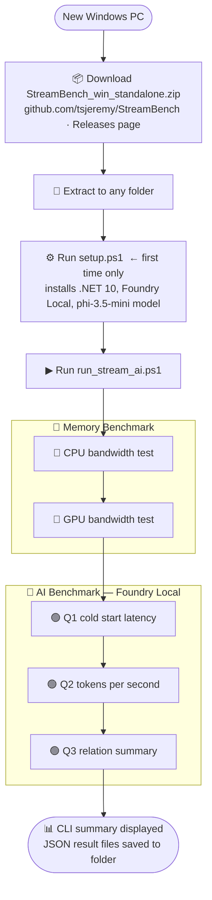
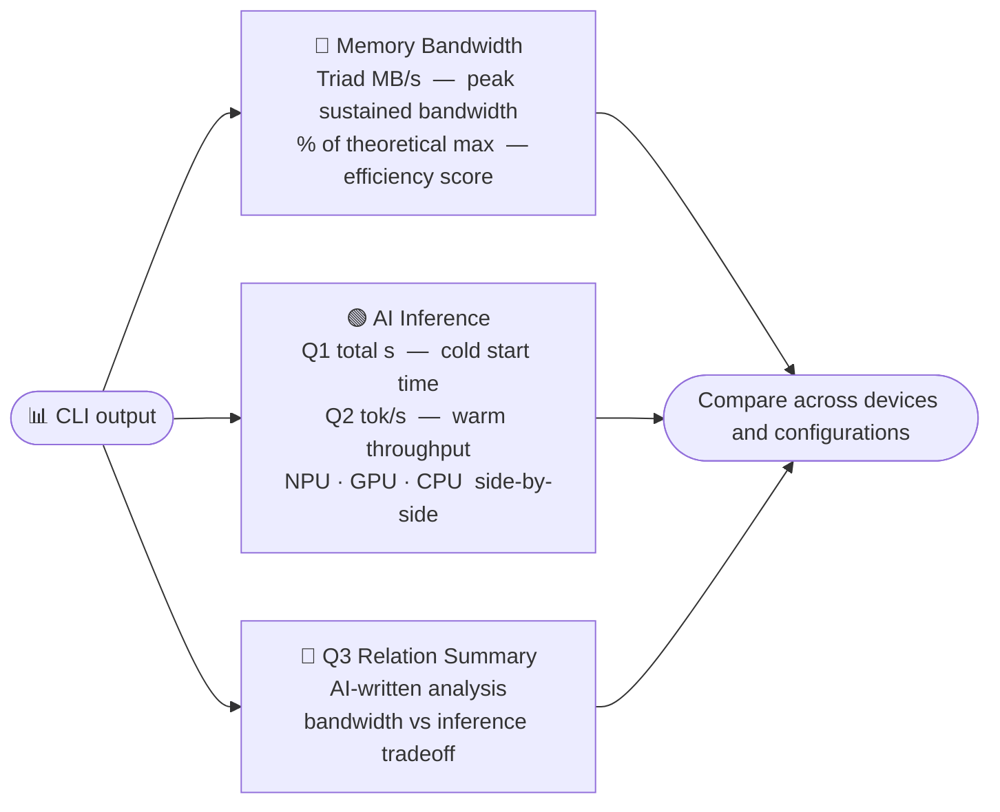

<p align="center">
  
</p>

# STREAM Memory Bandwidth Benchmark

A cross-platform **memory bandwidth benchmark** with both **CPU** and **GPU** versions, based on the
industry-standard [STREAM benchmark](http://www.cs.virginia.edu/stream/ref.html) by John D. McCalpin.
Also includes an **AI inference benchmark** using [Microsoft AI Foundry Local](https://learn.microsoft.com/en-us/azure/ai-foundry/foundry-local/)
to measure LLM response time and tokens/second on CPU, GPU, and NPU.

## Architecture

| Component | Technology | Role |
|-----------|-----------|------|
| `stream.c` | C + OpenMP | CPU memory bandwidth kernels (headless backend, outputs JSON) |
| `stream_gpu.c` | C + OpenCL | GPU memory bandwidth kernels (headless backend, outputs JSON) |
| `StreamBench/` | .NET 10 | User-facing CLI — colored output, JSON/CSV saving, AI inference benchmark |

The C backends run the performance-critical kernels and output raw JSON to stdout.
The **StreamBench** .NET app is the primary entry point — it launches the C backend,
displays color-formatted results, saves files, and runs the AI inference benchmark.

```
  User -> StreamBench (.NET 10) -> stream_cpu / stream_gpu (C)
                                        | JSON on stdout
                        <- display colored table, save .csv / .json

  User -> StreamBench (.NET 10) --ai -> Foundry Local CLI + REST API
                                        | runs SLM on CPU / GPU / NPU
                        <- display inference timing, tokens/sec, save .json
```

---

## Download & Run (Pre-built Binaries — No Build Required)

Pre-built binaries for **Windows** and **macOS** (x64 + ARM64) are available on the
[Releases page](https://github.com/tsjeremy/StreamBench/releases/tag/v5.10.18).
No compiler, .NET SDK, or build tools needed — just download and run.

Each `StreamBench` binary has the CPU and GPU benchmark engines **embedded inside**,
so you only need a single download. The benchmarks still run as native C code for
maximum performance — StreamBench extracts them automatically on first run.

> **Windows users**: A standalone **zip package** (`StreamBench_v5.10.18_win_standalone.zip`)
> is also available — download one file, extract, and run. Includes setup script,
> launcher scripts, and all four Windows executables (standard + AI-enabled).

### Setup & run flow



### Windows — Standalone ZIP (recommended)

1. Go to the **[v5.10.18 Release](https://github.com/tsjeremy/StreamBench/releases/tag/v5.10.18)**
2. Download **`StreamBench_v5.10.18_win_standalone.zip`**
3. Extract to any folder and run:

```powershell
# First-time setup (installs prerequisites: VC++ Redist, .NET 10 Runtime,
# PowerShell 7, and Foundry Local for AI — all silent via winget)
.\.setup.ps1

# Memory benchmark (CPU + GPU) — auto-runs setup.ps1 if prerequisites are missing
.\run_stream.ps1

# Memory + AI benchmark — auto-runs setup.ps1 if prerequisites are missing
.\run_stream_ai.ps1
```

### Windows — Individual exe download

1. Go to the **[v5.10.18 Release](https://github.com/tsjeremy/StreamBench/releases/tag/v5.10.18)**
2. Download the exe for your architecture:

| File | Description |
|------|-------------|
| `StreamBench_win_x64.exe` | Memory benchmark only (x64) |
| `StreamBench_win_arm64.exe` | Memory benchmark only (ARM64) |
| `StreamBench_win_x64_ai.exe` | Memory + AI benchmark (x64) |
| `StreamBench_win_arm64_ai.exe` | Memory + AI benchmark (ARM64) |

3. Run it:

```powershell
# CPU benchmark
.\StreamBench_win_x64.exe --cpu

# GPU benchmark
.\StreamBench_win_x64.exe --gpu

# AI inference benchmark (requires AI-enabled exe + Foundry Local)
# The _ai binary auto-runs memory + AI on all devices (CPU/GPU/NPU) with no flags needed:
.\StreamBench_win_x64_ai.exe

# Or specify devices explicitly:
.\StreamBench_win_x64_ai.exe --ai --ai-device cpu,gpu
```

> **ARM64 Windows users** (Snapdragon/Qualcomm): Use `*_arm64*` variants instead.

#### One-liner PowerShell (copy-paste)

```powershell
Invoke-WebRequest "https://github.com/tsjeremy/StreamBench/releases/download/v5.10.18/StreamBench_win_x64.exe" -OutFile StreamBench.exe; .\StreamBench.exe --cpu
```

### macOS — Download and run

1. Go to the **[v5.10.18 Release](https://github.com/tsjeremy/StreamBench/releases/tag/v5.10.18)**
2. Download **`StreamBench_osx-arm64`** (Apple Silicon) or **`StreamBench_osx-x64`** (Intel)
3. Run it:

```bash
chmod +x StreamBench_osx-arm64
./StreamBench_osx-arm64 --cpu
./StreamBench_osx-arm64 --gpu
```

#### One-liner bash (copy-paste into Terminal)

```bash
curl -fLO https://github.com/tsjeremy/StreamBench/releases/download/v5.10.18/StreamBench_osx-arm64 && chmod +x StreamBench_osx-arm64 && ./StreamBench_osx-arm64 --cpu
```

### Using the launcher scripts (alternative)

The launcher scripts are available as separate downloads on the
[release page](https://github.com/tsjeremy/StreamBench/releases/tag/v5.10.18).

- **`setup.ps1`**: first-time setup — installs VC++ Redistributable, .NET 10 Runtime, PowerShell 7, and Foundry Local (all silent via winget; standalone mode auto-detected)
- **`run_stream.ps1`**: default memory benchmark launcher (CPU + GPU only) — **auto-runs `setup.ps1`** if prerequisites are missing
- **`run_stream_ai.ps1`**: memory + AI launcher (CPU + GPU + AI, uses `*_ai.exe` when available) — **auto-runs `setup.ps1`** if prerequisites are missing

Download the script(s) alongside the `StreamBench_*` binary and run:

- **Windows**:
  ```powershell
  # If blocked by execution policy ("not digitally signed" error), unblock first:
  Unblock-File .\run_stream.ps1
  .\run_stream.ps1

  # Memory + AI launcher:
  Unblock-File .\run_stream_ai.ps1
  .\run_stream_ai.ps1

  # Or run directly with bypass:
  pwsh -ExecutionPolicy Bypass -File .\run_stream.ps1
  pwsh -ExecutionPolicy Bypass -File .\run_stream_ai.ps1
  ```
- **macOS/Linux**: `pwsh ./run_stream.ps1` or `pwsh ./run_stream_ai.ps1`

Launcher environment overrides:

```powershell
# Override default 200M array size for both launchers
$env:STREAMBENCH_ARRAY_SIZE = "100000000"

# Optional AI launcher overrides (run_stream_ai.ps1)
$env:STREAMBENCH_AI_MODEL = "phi-4-mini"
$env:STREAMBENCH_AI_DEVICES = "cpu,npu"   # if unset, all detected devices are used
$env:STREAMBENCH_AI_NO_DOWNLOAD = "1"     # cached models only
```

### Standalone C backend binaries (advanced)

The individual C backend binaries (`stream_cpu_*`, `stream_gpu_*`) are also available on the
release page for users who want to run them directly without the StreamBench frontend:

```bash
# Run C backend directly (outputs raw JSON to stdout)
./stream_cpu_macos_arm64 --array-size 200000000
./stream_gpu_win_x64.exe --array-size 200000000
```

---

## Build from Source

> Building from source? See **[BUILDING.md](BUILDING.md)** for prerequisites, compiler setup, build scripts, and step-by-step compilation guides for Windows, macOS, and Linux.

---

## AI Inference Benchmark (`--ai`)

StreamBench includes an AI inference benchmark powered by
**[Microsoft AI Foundry Local](https://learn.microsoft.com/en-us/azure/ai-foundry/foundry-local/)**,
which runs small language models (SLMs) directly on-device with hardware acceleration.

### What it measures

| Metric | Description |
|--------|-------------|
| **Model load time** | Time to load the model into device memory (one-time cost) |
| **Q1 response time** | Time for the first inference — "Hello World!" |
| **Q1 total time** | Model load + Q1 response (what a cold-start user experiences) |
| **Q2 response time** | Time for the second inference — "How to calculate memory bandwidth on different memory?" |
| **Tokens/second** | Output throughput (completion tokens ÷ inference time) |

The benchmark runs Q1 immediately after model loading (cold run), then Q2 with the model
already resident in memory (warm run). This lets you compare cold-start latency with
sustained inference throughput across CPU, GPU, and NPU.

### Prerequisites

Microsoft AI Foundry Local must be installed on the target machine:

```powershell
# Windows
winget install Microsoft.FoundryLocal
```

```bash
# macOS
brew install foundrylocal
```

### Running the AI benchmark

```powershell
# Memory-only default (CPU + GPU)
.\StreamBench.exe

# Add AI benchmark on all available AI devices (CPU/GPU/NPU)
.\StreamBench.exe --ai

# Benchmark specific devices
.\StreamBench.exe --ai --ai-device cpu,gpu

# Use a specific model
.\StreamBench.exe --ai --ai-model phi-3.5-mini

# Quick mode — cached models only, skip shared pass, 1 model/device (CI/automated)
.\StreamBench.exe --ai --quick-ai

# Shared-model comparison only (skip best-per-device pass)
.\StreamBench.exe --ai --ai-shared-only

# Use only cached models (no downloads)
.\StreamBench.exe --ai --ai-no-download

# Don't save the JSON result file
.\StreamBench.exe --ai --no-save
```

StreamBench prints full Q1/Q2 answers and, when memory JSON exists, also runs
relation questions (Q3 and future Q4/Q5...) on each selected AI device.
All relation questions use the same question output style and the same
latency/tokens-per-second reporting method.

When benchmarking multiple devices together, StreamBench chooses shared model aliases
by this order:

1. Highest selected-device coverage (CPU/GPU/NPU variants available)
2. Most cached variants for the selected devices
3. Internal shared-priority list (ordered by real-world download + inference speed)

The shared pass is capped at **5 model attempts** and a **10-minute time budget**
to prevent runaway loops. When cached models are available, the shared pass
skips downloads and uses cached models first. If the Foundry service crashes
(2 consecutive failures), StreamBench automatically restarts it once before
falling back to per-device defaults.

If no alias covers all selected devices, StreamBench automatically falls back to
the best partial coverage and then runs best-per-device comparison pass.

If NPU model load fails during automatic multi-device comparison, or no NPU
models exist in the catalog, StreamBench removes NPU from the shared pass and
continues with CPU/GPU.

For single-device runs, StreamBench uses device-specific priority lists and prefers
cached models first to reduce download/startup time.

### Example output

```
══════════════════════════════════════════════════════════════
  AI Inference Benchmark — Microsoft.AI.Foundry.Local
══════════════════════════════════════════════════════════════
  Q1 (cold): Hello World!
  Q2 (warm): How to calculate memory bandwidth on different memory?

── AI Benchmark: CPU (qwen2.5-0.5b-instruct-generic-cpu) ──
╭──────────────── Model Info ─────────────────╮
│ Device             │ CPU                    │
│ Model ID           │ qwen2.5-0.5b-instruct… │
│ Execution Provider │ CPUExecutionProvider   │
╰────────────────────┴────────────────────────╯
╭────── Inference Timing ──────────────────────────────────────────────╮
│ Run                   │ Load (s) │ Response (s) │ Total (s) │ Tok/s  │
├───────────────────────┼──────────┼──────────────┼───────────┼────────┤
│ Q1 (cold, incl. load) │    1.243 │        3.517 │     4.760 │  42.3  │
│ Q2 (warm)             │       —  │        2.891 │     2.891 │  51.6  │
╰───────────────────────┴──────────┴──────────────┴───────────┴────────╯
```

### Key metrics



### Saved output

Results are saved as `ai_inference_benchmark_<timestamp>.json` with full details
including model info, per-run timings, token counts, full Q1/Q2 response text,
and response previews.

When memory JSON exists in the output directory, StreamBench also runs and saves
`ai_relation_summary_<model-alias>_<timestamp>.json` containing Q1 (cold),
Q2 (warm), Q3 (local JSON summary), and future Qn relation prompts per device,
plus parsed cross-file relation aggregates for model comparison over time.
This relation summary uses a unified `questions` array schema (`index`,
`question`, `answer`, `device_type`, `run`) so future prompts (Q4/Q5...) keep
the same JSON/log/CLI structure and timing metrics.

In addition, after AI completes, StreamBench embeds these AI sections into each
memory benchmark JSON (`stream_cpu_results_*.json`, `stream_gpu_results_*.json`,
`stream_npu_results_*.json`) so Q1/Q2/Q3 (and future Qn) remain available in
the same saved file:

- `ai_inference_benchmark` (Q1/Q2 runs)
- `ai_relation_summary` (device-tagged relation question answers and timing)

### Interpreting results

- **Higher tokens/second** = better inference throughput (limited by memory bandwidth)
- **Lower model load time** = faster cold start (depends on storage speed and model size)
- **NPU > GPU > CPU** in tokens/second is typical for small models on compatible hardware
- Compare Q1 total time vs Q2 time to understand the impact of model loading

The tokens/second metric is directly comparable to your memory bandwidth results
(higher memory bandwidth → higher tokens/second, especially for CPU inference).

---

## Features

### .NET 10 Frontend (`StreamBench/`)

- **Rich colored output** using platform-native .NET Console API — works on Windows Terminal, macOS Terminal, Linux
- **Formatted tables** for system info, memory modules, cache hierarchy, and benchmark results
- **JSON and CSV file saving** — consistent format for analysis and archiving
- **Range testing** — sweep multiple array sizes, save consolidated CSV
- **AI-extensible** — .NET 10 platform for future analysis and AI features

### CPU Backend (`stream.c`)

- OpenMP multi-threading with automatic core detection
- Native Windows support (`QueryPerformanceCounter`, `GetSystemInfo`)
- Tuned kernel variants (`/DTUNED`)
- x64 and ARM64 support
- Runtime `--array-size N` argument

### GPU Backend (`stream_gpu.c`)

- **Zero SDK dependency** — OpenCL loaded dynamically via `LoadLibrary` / `dlopen`
- Works with any OpenCL-capable GPU: AMD, NVIDIA, Intel, Apple
- Automatic GPU discovery and device info
- Runtime `--array-size N` argument

---

## What Bandwidth Should I Expect?

The results depend on your memory type, number of channels, and frequency:

| Memory Type | Typical Config | Theoretical Max | Expected CPU STREAM | Expected GPU STREAM |
|-------------|---------------|-----------------|--------------------|--------------------|
| DDR4-3200 | Dual-channel | ~51 GB/s | ~35–45 GB/s | N/A (no iGPU BW advantage) |
| DDR5-5600 | Dual-channel | ~90 GB/s | ~55–70 GB/s | ~60–80 GB/s |
| DDR5-6400 | Dual-channel | ~102 GB/s | ~65–80 GB/s | ~70–90 GB/s |
| LPDDR5X-7500 | Quad-channel | ~120 GB/s | ~70–90 GB/s | ~90–110 GB/s |
| LPDDR5X-8000 | 8-channel | ~256 GB/s | ~90–110 GB/s | ~180–220 GB/s |
| LPDDR5-6400 (Apple M1 Ultra) | 1024-bit unified | ~819 GB/s | ~280–300 GB/s (20-thread) | ~600–680 GB/s |

> **Tip:** If your results are significantly below these ranges, check that all memory channels are
> populated, XMP/EXPO profiles are enabled in BIOS, and the system is plugged in (not on battery).

---


## Array Size Guidelines

For accurate bandwidth measurement, the total memory used should be **at least 4× your largest cache**:

| System | Typical L3 Cache | Recommended `STREAM_ARRAY_SIZE` | Total Memory Used |
|--------|------------------|--------------------------------|-------------------|
| Desktop (Intel/AMD) | 16–64 MB | 100,000,000 (100M) | ~2.4 GB |
| Laptop | 8–32 MB | 50,000,000 (50M) | ~1.2 GB |
| Workstation (64+ MB L3) | 64 MB | 200,000,000 (200M) | ~4.5 GB |
| Memory-limited system | — | 10,000,000 (10M) | ~240 MB |

Additional guidance:

- Keep array size consistent when comparing two runs or two devices.
- Very small sizes (for example 5M–20M) can be skewed by cache effects and may not
  represent sustained memory bandwidth.
- If 200M causes memory pressure on your machine, use a smaller size via
  `--array-size` (CLI) or `STREAMBENCH_ARRAY_SIZE` (launcher scripts).

---

## Original Project

STREAM is the de facto industry standard benchmark for measuring sustained memory bandwidth.
Original code and documentation by **John D. McCalpin, Ph.D.**

*   **Website**: http://www.cs.virginia.edu/stream/ref.html
*   **Original Source**: `stream.c` and `stream.f`

## License

See [LICENSE.txt](LICENSE.txt) and the header in `stream.c` for license information.
GPU results from `stream_gpu.c` must be labelled as "GPU variant of the STREAM benchmark code".
