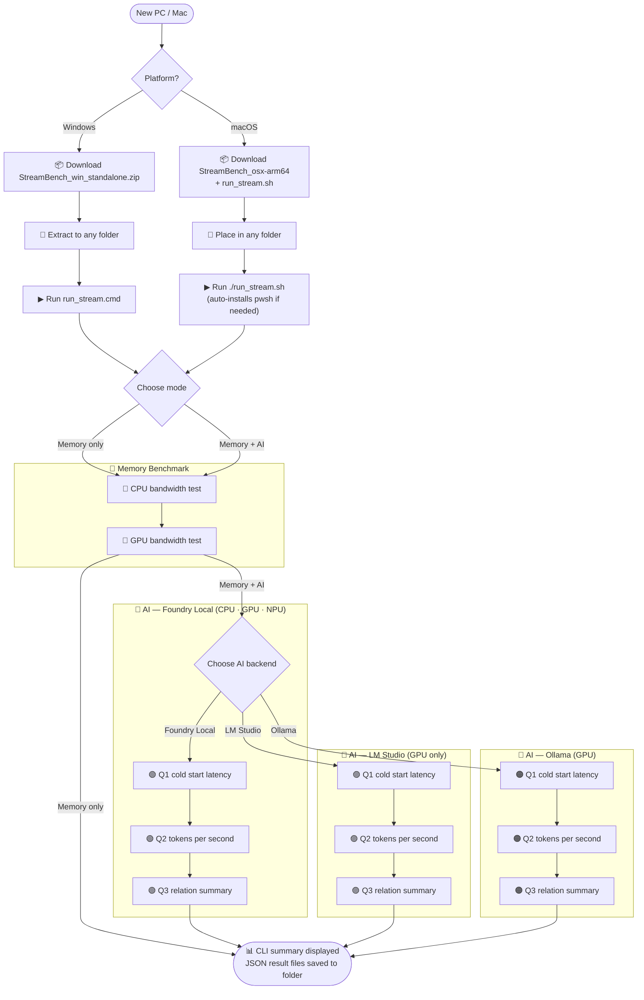
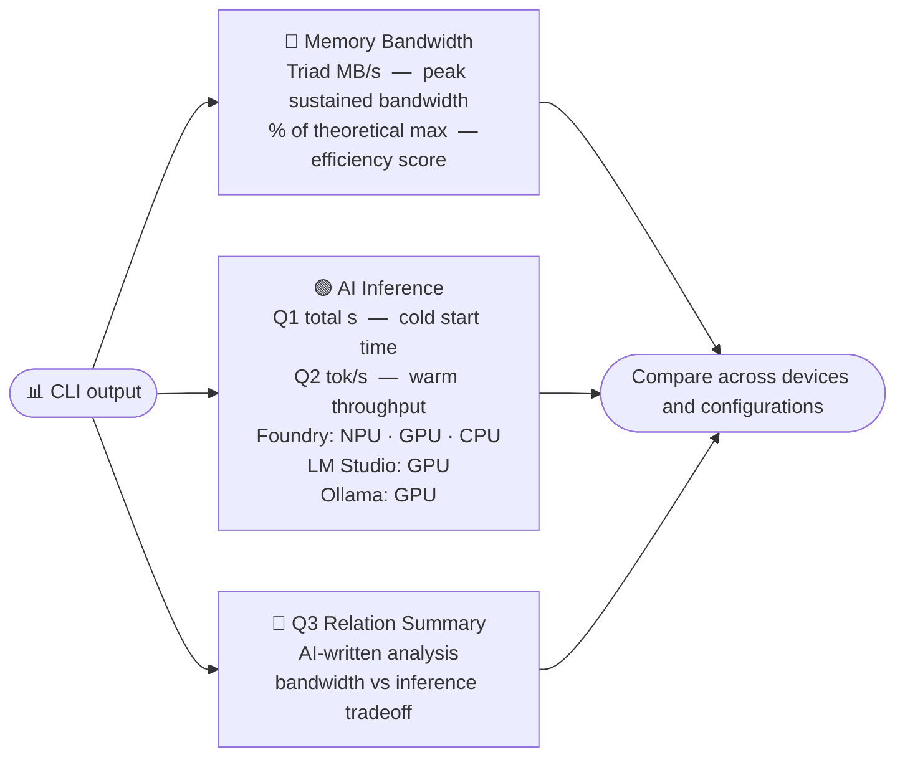

# STREAM Memory Bandwidth Benchmark

A cross-platform **memory bandwidth benchmark** with both **CPU** and **GPU** versions, based on the
industry-standard [STREAM benchmark](http://www.cs.virginia.edu/stream/ref.html) by John D. McCalpin.
Also includes an **AI inference benchmark** supporting [Microsoft AI Foundry Local](https://learn.microsoft.com/en-us/azure/ai-foundry/foundry-local/), [LM Studio](https://lmstudio.ai), and [Ollama](https://ollama.com/) to measure LLM response time and tokens/second on CPU, GPU, and NPU.

## Quick Start

- **Windows:** run `run_stream.cmd`
- **Windows (PowerShell):** run `./run_stream.ps1`
- **macOS / Linux:** run `./run_stream.sh` (auto-detects PowerShell, falls back to binary)
- **macOS (direct):** download the Apple Silicon binary, remove quarantine if needed, then run `./StreamBench_osx-arm64 --cpu`
- **AI mode:** add `--ai` or use the AI-enabled launcher (`run_stream_ai.cmd` / `run_stream_ai.sh`)

## Contents

- [Architecture](#architecture)
- [What's New vs. STREAM](#whats-new-vs-stream)
- [Download & Run (Pre-built Binaries — No Build Required)](#download--run-pre-built-binaries--no-build-required)
- [Build from Source](#build-from-source)
- [AI Inference Benchmark (`--ai`)](#ai-inference-benchmark---ai)
- [What Bandwidth Should I Expect?](#what-bandwidth-should-i-expect)
- [Array Size Guidelines](#array-size-guidelines)
- [License](#license)

## Architecture

| Component | Technology | Role |
|-----------|-----------|------|
| `stream.c` | C + OpenMP | CPU memory bandwidth kernels (headless backend, outputs JSON) |
| `stream_gpu.c` | C + OpenCL | GPU memory bandwidth kernels (headless backend, outputs JSON) |
| `StreamBench/` | .NET 10 | User-facing CLI — colored output, JSON/CSV saving, AI inference benchmark |

The C backends run the performance-critical kernels and output raw JSON to stdout.
The **StreamBench** .NET app is the primary entry point — it launches the C backend,
displays color-formatted results, saves files, and runs the AI inference benchmark.

```
  User -> StreamBench (.NET 10) -> stream_cpu / stream_gpu (C)
                                        | JSON on stdout
                        <- display colored table, save .csv / .json

  User -> StreamBench (.NET 10) --ai -> AI Backend (Foundry Local, LM Studio, or Ollama)
                                        | runs SLM on CPU / GPU / NPU
                        <- display inference timing, tokens/sec, save .json
```

**Key capabilities:**

- **Rich colored output** with formatted tables — works on Windows Terminal, macOS Terminal, Linux
- **JSON and CSV file saving** — consistent format for analysis and archiving
- **Range testing** — sweep multiple array sizes, save consolidated CSV
- **OpenMP multi-threading** with automatic core detection, x64 and ARM64 support
- **Tuned kernel variants** (`/DTUNED`) for optimized bandwidth measurement
- **Zero GPU SDK dependency** — OpenCL loaded dynamically via `LoadLibrary` / `dlopen`

---

## What's New vs. STREAM

### Comparison with upstream STREAM benchmark

StreamBench is a from-scratch rewrite for Windows and macOS, built on the measurement
methodology of [STREAM](https://github.com/jeffhammond/STREAM) —
the industry standard for sustained memory bandwidth since 1991.
It adds a .NET 10 frontend, GPU support, and AI inference benchmarking
while preserving the core Copy / Scale / Add / Triad kernels.

| Capability | [STREAM](https://github.com/jeffhammond/STREAM) | StreamBench |
|------------|------------------|-------------|
| **CPU bandwidth (Copy/Scale/Add/Triad)** | ✅ — the gold standard | ✅ Same kernels, same methodology |
| **Language** | C and Fortran | C (backend) + .NET 10 (frontend) |
| **GPU bandwidth** | — | ✅ OpenCL-based GPU STREAM (zero SDK dependency) |
| **AI inference benchmark** | — | ✅ LLM tok/s on CPU, GPU, NPU — correlates bandwidth with AI throughput |
| **Output format** | Plain text to stdout | Colored tables + JSON + CSV (machine-readable) |
| **Pre-built binaries** | Compile from source | ✅ Download-and-run binaries for Windows and macOS |
| **Platform support** | Portable C — runs anywhere with a compiler | Windows, macOS, Linux — with automated setup |
| **System info detection** | — | ✅ CPU model, memory type/speed, cache hierarchy, GPU device |
| **Setup automation** | — | ✅ `setup.ps1` auto-installs prerequisites and AI backends |
| **OpenMP threading** | ✅ | ✅ Same approach |
| **MPI support** | ✅ (`stream_mpi.c` for distributed systems) | — (focused on single-node) |
| **Fortran version** | ✅ | — |
| **Array size** | Compile-time `STREAM_ARRAY_SIZE` | Runtime `--array-size N` argument |

> [STREAM](https://github.com/jeffhammond/STREAM) remains the authoritative reference
> for HPC environments, MPI clusters, and Fortran-based workflows.
> StreamBench targets a different audience — users who want a quick, visual benchmark
> with pre-built binaries, GPU coverage, and the ability to correlate memory bandwidth with
> AI inference performance on modern hardware.

---

## Download & Run (Pre-built Binaries — No Build Required)

Pre-built binaries for **Windows** and **macOS** (x64 + ARM64) are available on the
[Releases page](https://github.com/tsjeremy/StreamBench/releases/latest).
No compiler, .NET SDK, or build tools needed — just download and run.

Each `StreamBench` binary has the CPU and GPU benchmark engines **embedded inside**,
so you only need a single download. The benchmarks still run as native C code for
maximum performance — StreamBench extracts them automatically on first run.

> **Windows users**: A standalone **zip package** (`StreamBench_<version>_win_standalone.zip`)
> is also available — download one file, extract, and run. Includes setup script,
> launcher scripts, and all four Windows executables (standard + AI-enabled).

### Setup & run flow (diagram)



### Windows — Standalone ZIP (recommended)

1. Go to the **[Latest Release](https://github.com/tsjeremy/StreamBench/releases/latest)**
2. Download the standalone zip (e.g. `StreamBench_v<version>_win_standalone.zip`)
3. Extract to any folder and run the recommended Windows entrypoint:

```cmd
run_stream.cmd
```

This opens a simple launcher where you can choose:

- **Memory benchmark only**
- **Memory benchmark + AI benchmark**

If you choose AI mode, the launcher also prompts for the backend:

- **Auto-detect**
- **Foundry Local**
- **LM Studio**
- **Ollama**

Each launcher-driven run also writes a full CLI transcript beside the launcher,
for example `StreamBench_cli_20260314_221646.log`.

If prerequisites are missing, the launcher automatically runs `setup.ps1` first.

Optional manual / advanced path:

```powershell
# Explicit first-time setup (optional)
.\setup.ps1

# Same unified launcher inside PowerShell
.\run_stream.ps1

# Compatibility shortcut that preselects AI mode
.\run_stream_ai.ps1
```

### Windows — Individual exe download

1. Go to the **[Latest Release](https://github.com/tsjeremy/StreamBench/releases/latest)**
2. Download the exe for your architecture:

| File | Description |
|------|-------------|
| `StreamBench_win_x64.exe` | Memory benchmark only (x64) |
| `StreamBench_win_arm64.exe` | Memory benchmark only (ARM64) |
| `StreamBench_win_x64_ai.exe` | Memory + AI benchmark (x64) |
| `StreamBench_win_arm64_ai.exe` | Memory + AI benchmark (ARM64) |

3. Run it:

```powershell
# CPU benchmark
.\StreamBench_win_x64.exe --cpu

# GPU benchmark
.\StreamBench_win_x64.exe --gpu

# AI inference benchmark (requires AI-enabled exe + Foundry Local, LM Studio, or Ollama)
# The _ai binary auto-runs memory (CPU/GPU) + AI (CPU/GPU/NPU) with no flags needed:
.\StreamBench_win_x64_ai.exe

# Or specify devices explicitly:
.\StreamBench_win_x64_ai.exe --ai --ai-device cpu,gpu
```

> **ARM64 Windows users:** Use `*_arm64*` variants instead.

#### One-liner PowerShell (copy-paste)

```powershell
Invoke-WebRequest "https://github.com/tsjeremy/StreamBench/releases/latest/download/StreamBench_win_x64.exe" -OutFile StreamBench.exe; .\StreamBench.exe --cpu
```

### macOS — Quick start (recommended)

1. Go to the **[Latest Release](https://github.com/tsjeremy/StreamBench/releases/latest)**
2. Download **`StreamBench_osx-arm64`** (Apple Silicon) and **`run_stream.sh`**
3. Place both files in the same folder and run:

```bash
chmod +x run_stream.sh
./run_stream.sh
```

The shell script automatically finds PowerShell (`pwsh`) if installed, or falls
back to running the binary directly. It also handles quarantine removal for you.

> **New Mac?** If PowerShell isn't installed, `run_stream.sh` still works — it runs
> the binary in direct mode. For the full launcher experience (mode selection, AI
> backend choices, CLI transcript), install PowerShell first:
> `brew install powershell`

### macOS — Manual binary download

1. Go to the **[Latest Release](https://github.com/tsjeremy/StreamBench/releases/latest)**
2. Download **`StreamBench_osx-arm64`** (Apple Silicon)
3. Remove the macOS quarantine flag and make it executable:

```bash
xattr -d com.apple.quarantine StreamBench_osx-arm64
chmod +x StreamBench_osx-arm64
./StreamBench_osx-arm64 --cpu
./StreamBench_osx-arm64 --gpu
```

> macOS blocks unsigned binaries downloaded from the internet.
> The `xattr` command above removes this block. Alternatively, right-click the file
> in Finder → Open, then confirm in the dialog.

#### One-liner bash (copy-paste into Terminal)

```bash
curl -fLO https://github.com/tsjeremy/StreamBench/releases/latest/download/StreamBench_osx-arm64 && xattr -d com.apple.quarantine StreamBench_osx-arm64 && chmod +x StreamBench_osx-arm64 && ./StreamBench_osx-arm64 --cpu
```

#### macOS — Full setup with AI benchmark

The easiest path is `run_stream_ai.sh` (AI mode preselected):

```bash
chmod +x run_stream_ai.sh
./run_stream_ai.sh
```

If PowerShell is not installed, the script falls back to running the binary
with `--ai` directly. For the full setup flow (Homebrew, .NET, AI backends,
model downloads), install PowerShell first:

```bash
# 1. Install Homebrew (if not already installed — the macOS package manager)
/bin/bash -c "$(curl -fsSL https://raw.githubusercontent.com/Homebrew/install/HEAD/install.sh)"

# 2. Add Homebrew to PATH (Apple Silicon Macs — restart terminal or run this)
eval "$(/opt/homebrew/bin/brew shellenv)"

# 3. Install PowerShell (if not already installed)
brew install powershell

# 4. Run setup — installs libomp, AI backends, and downloads default model
pwsh ./setup.ps1

# 5. Run the benchmark (memory + AI)
pwsh ./run_stream.ps1

# Or run directly with AI:
./StreamBench_osx-arm64 --ai
./StreamBench_osx-arm64 --ai --ai-backend foundry
./StreamBench_osx-arm64 --ai --ai-backend lmstudio
./StreamBench_osx-arm64 --ai --ai-backend ollama
```

> **New MacBook?** The fastest path is: install [Homebrew](https://brew.sh), then PowerShell (`brew install powershell`),
> then run `pwsh ./setup.ps1` — everything else is automatic.
> Or just run `./run_stream.sh` — it works without PowerShell (direct binary mode).

### Launcher scripts

The launcher files are included in the standalone ZIP and also available as separate
downloads on the [release page](https://github.com/tsjeremy/StreamBench/releases/latest).

| Script | Description |
|--------|-------------|
| `setup.ps1` | First-time setup — installs runtime dependencies and AI backends (VC++ Redist, .NET, Foundry Local, LM Studio, Ollama). Auto-detects standalone vs. source mode. |
| `run_stream.cmd` | Recommended Windows entrypoint — PowerShell bypass, mode selection, CLI transcript. |
| `run_stream.sh` | Recommended macOS / Linux entrypoint — tries `pwsh`, falls back to direct binary with auto quarantine removal. |
| `run_stream.ps1` | Unified PowerShell launcher (Windows/macOS/Linux) — auto-runs `setup.ps1` if needed. |
| `run_stream_ai.cmd` | Windows shortcut that preselects AI mode. |
| `run_stream_ai.sh` | macOS / Linux shortcut that preselects AI mode. |
| `run_stream_ai.ps1` | Cross-platform PowerShell shortcut that preselects AI mode. |

**Usage:**

```cmd
rem Windows (recommended)
run_stream.cmd

rem Windows AI shortcut
run_stream_ai.cmd
```

```powershell
# PowerShell (any platform)
.\run_stream.ps1

# AI shortcut
.\run_stream_ai.ps1
```

```bash
# macOS/Linux (recommended — no PowerShell required)
./run_stream.sh

# macOS/Linux AI shortcut
./run_stream_ai.sh

# macOS/Linux (PowerShell)
pwsh ./run_stream.ps1
```

### Launcher environment overrides

```powershell
# Override default 200M array size for both launchers
$env:STREAMBENCH_ARRAY_SIZE = "100000000"

# Preselect launcher mode without prompting (advanced / automation)
$env:STREAMBENCH_LAUNCH_MODE = "ai"

# Optional AI launcher overrides (applied when AI mode is selected)
$env:STREAMBENCH_AI_BACKEND = "lmstudio"  # auto, lmstudio, foundry, ollama
$env:STREAMBENCH_AI_MODEL = "phi-4-mini"
$env:STREAMBENCH_AI_DEVICES = "cpu,npu"   # if unset, all detected devices are used
$env:STREAMBENCH_AI_NO_DOWNLOAD = "1"     # cached models only
```

When running from source (`StreamBench.csproj`) instead of a standalone package,
the launcher expects local native backends (`stream_cpu_*`, `stream_gpu_*`) for
the memory benchmark. If they are not built yet, the launcher warns clearly
and continues with **AI-only mode** so local backend validation can still run.
Q3 still requires at least one saved `stream_*_results_*.json` file.

### Standalone C backend binaries (advanced)

The individual C backend binaries (`stream_cpu_*`, `stream_gpu_*`) are also available on the
release page for users who want to run them directly without the StreamBench frontend:

```bash
# Run C backend directly (outputs raw JSON to stdout)
./stream_cpu_macos_arm64 --array-size 200000000
./stream_gpu_win_x64.exe --array-size 200000000
```

---

## Build from Source

> Building from source? See **[BUILDING.md](BUILDING.md)** for prerequisites, compiler setup, build scripts, and step-by-step compilation guides for Windows, macOS, and Linux.

---

## AI Inference Benchmark (`--ai`)

StreamBench includes an AI inference benchmark supporting three backends:

- **[Microsoft AI Foundry Local](https://learn.microsoft.com/en-us/azure/ai-foundry/foundry-local/)** — runs SLMs with hardware-specific optimization (CPU, GPU, NPU) on Windows and macOS
- **[LM Studio](https://lmstudio.ai)** — cross-platform (Windows, macOS, Linux) GPU/CPU inference via llama.cpp
- **[Ollama](https://ollama.com/)** — cross-platform (Windows, macOS, Linux) single-pass GPU inference, easy model management via CLI

| Backend | CPU | GPU | NPU |
|---------|-----|-----|-----|
| Microsoft Foundry Local | ✅ | ✅ | ✅ (Windows, NPU via OpenVINO) |
| LM Studio (llama.cpp) | ✅ | ✅ | ❌ (no NPU backend) |
| Ollama | ✅ ¹ | ✅ | ❌ (no device targeting) |

> **NPU benchmarking requires Foundry Local.** LM Studio and Ollama have no NPU support. This is stated once here and applies throughout.
>
> ¹ Ollama runs a single inference pass (no per-device targeting). On macOS with Apple Silicon, it uses Metal (GPU). On systems with CUDA GPUs, it uses the GPU automatically. CPU fallback is automatic when no GPU is available.

All three backends expose OpenAI-compatible REST APIs. StreamBench uses a lightweight `DirectOpenAiChatClient` (custom `IChatClient` implementation) to avoid compatibility issues with SDK response parsing from local backends.

### What it measures

| Metric | Description |
|--------|-------------|
| **Model load time** | Time to load the model into device memory (one-time cost) |
| **Q1 response time** | Time for the first inference — "Hello World!" |
| **Q1 total time** | Model load + Q1 response (what a cold-start user experiences) |
| **Q2 response time** | Time for the second inference — "How to calculate memory bandwidth on different memory?" |
| **Q2 Tokens/second** | **Key metric** — output throughput with model already loaded (warm run) |

> **Why Q2 tokens/second is the key metric:** once the model is loaded, inference is *memory-bandwidth limited* — the bottleneck is how fast the hardware can stream model weights from RAM/VRAM/NPU memory into the compute units. A device with higher memory bandwidth produces higher tokens/second. This is why CPU, GPU, and NPU with the *same memory bandwidth* (e.g., unified LPDDR5X on a laptop SoC) tend to produce similar Q2 tok/s even with very different compute architectures.

The benchmark runs Q1 immediately after model loading (cold run), then Q2 with the model
already resident in memory (warm run). This lets you compare cold-start latency with
sustained inference throughput across CPU, GPU, and NPU.

### Prerequisites

Install at least one AI backend. The `setup.ps1` script auto-installs these when
you choose the AI benchmark, but you can also install them manually:

**Microsoft Foundry Local (Windows/macOS):**

```powershell
# Windows
winget install Microsoft.FoundryLocal
```

```bash
# macOS
brew tap microsoft/foundrylocal && brew install foundrylocal
```

**LM Studio (Windows/macOS/Linux):**

```powershell
# Windows (use --scope user on new Windows 11 PCs if default install fails)
winget install ElementLabs.LMStudio
```

```bash
# macOS
brew install --cask lm-studio
```

Then open LM Studio, download a model (e.g. phi-4-mini-instruct GGUF), and **load it into the server before running StreamBench** (LM Studio → Developer tab → Load a model).

**Ollama (Windows/macOS/Linux):**

```powershell
# Windows (use --scope user on new Windows 11 PCs if default install fails)
winget install Ollama.Ollama
```

```bash
# macOS
brew install ollama
```

Then pull a model and start the server:

```bash
ollama pull phi4-mini    # 3.8B params (~2.5 GB) — fast, efficient default
ollama serve             # Start server (runs automatically on macOS after install)
```

> **Tip:** Ollama manages model lifecycle automatically — no manual model loading step required.
> For a larger model, try `ollama pull gemma4:26b` (26B MoE, 4B active params, ~18 GB).

### Running the AI benchmark

```powershell
# Memory-only default (CPU + GPU)
.\StreamBench.exe                                   # Windows
./StreamBench_osx-arm64                             # macOS

# Add AI benchmark on all available AI devices (CPU/GPU/NPU)
.\StreamBench.exe --ai                              # Windows
./StreamBench_osx-arm64 --ai                        # macOS

# Benchmark specific devices
.\StreamBench.exe --ai --ai-device cpu,gpu

# Use a specific model
.\StreamBench.exe --ai --ai-model phi-4-mini

# Select AI backend explicitly
.\StreamBench.exe --ai --ai-backend lmstudio
.\StreamBench.exe --ai --ai-backend foundry
.\StreamBench.exe --ai --ai-backend ollama

# Use Ollama with a specific model
.\StreamBench.exe --ai --ai-backend ollama --ai-model phi4-mini

# Run AI only (skip default CPU/GPU memory passes)
.\StreamBench.exe --ai-only

# Auto-detect best available backend (default)
.\StreamBench.exe --ai --ai-backend auto

# Quick mode — cached models only, 1 model/device (CI/automated)
.\StreamBench.exe --ai --quick-ai

# Use only cached models (no downloads)
.\StreamBench.exe --ai --ai-no-download

# Use a custom endpoint (e.g. remote Ollama server)
.\StreamBench.exe --ai --ai-backend ollama --ai-endpoint http://192.168.1.100:11434

# Don't save the JSON result file
.\StreamBench.exe --ai --no-save
```

StreamBench prints full Q1/Q2 answers and, when memory JSON exists, also runs
relation questions (Q3 and future Q4/Q5...) on each selected AI device.
All relation questions use the same question output style and the same
latency/tokens-per-second reporting method.

When Q3 runs, the main `ai_inference_benchmark_*.json` file now embeds
`ai_relation_summary` so Q1/Q2/Q3 live together in one artifact, while
`ai_relation_summary_*.json` is still saved separately for direct inspection.

When benchmarking multiple devices together, StreamBench chooses shared model aliases
by this order:

1. Highest selected-device coverage (CPU/GPU/NPU variants available)
2. Most cached variants for the selected devices
3. Internal shared-priority list (ordered by real-world download + inference speed)

The shared pass is capped at **5 model attempts** and a **10-minute time budget**
to prevent runaway loops. When cached models are available, the shared pass
skips downloads and uses cached models first. If the Foundry service crashes
(2 consecutive failures), StreamBench automatically restarts it once before
falling back to per-device defaults.

If no alias covers all selected devices, StreamBench automatically falls back to
the best partial coverage and continues with the available devices.

If GPU or NPU models are not available in the current backend catalog,
StreamBench removes those devices from the active pass automatically and
continues with the devices that do have compatible models.

For single-device runs, StreamBench uses device-specific priority lists and prefers
cached models first to reduce download/startup time.

### Example output — Foundry Local (CPU)

```
══════════════════════════════════════════════════════════════
  AI Inference Benchmark — Foundry Local
══════════════════════════════════════════════════════════════
  Q1 (cold): Hello World!
  Q2 (warm): How to calculate memory bandwidth on different memory?
  Q3 (relation): Summarize local memory bandwidth and AI benchmark results from saved JSON files.
Starting Foundry Local AI service...
  Service URL: http://127.0.0.1:54797
  Loading model catalog (first run may download execution providers)...
  Catalog models by device: CPU (19), GPU (36), NPU (11)

── AI Benchmark: CPU (Phi-4-mini-instruct-generic-cpu:5) ──

╭──────────────────────── Model Info ────────────────────────╮
│ Property               │ Value                             │
├────────────────────────┼───────────────────────────────────┤
│ Device                 │ CPU                               │
│ Model ID               │ Phi-4-mini-instruct-generic-cpu:5 │
│ Alias                  │ phi-4-mini                        │
╰────────────────────────┴───────────────────────────────────╯
╭──────────────────────────────── Inference Timing ─────────────────────────────────╮
│ Run                   │ Load (s) │ Response (s) │ Total (s) │ Tokens │   Tok/s │
├───────────────────────┼──────────┼──────────────┼───────────┼────────┼─────────┤
│ Q1 (cold, incl. load) │    8.268 │        4.418 │    12.685 │    108 │    24.4 │
│ Q2 (warm)             │        — │       46.688 │    46.688 │    692 │    14.8 │
╰───────────────────────┴──────────┴──────────────┴───────────┴────────┴─────────╯
  Q2 (warm) tok/s = sustained throughput — memory-bandwidth limited

╭────────────────────────────── Device Comparison ──────────────────────────────╮
│ Device │ Model      │ Load (s) │ Q1 Total (s) │ Q1 Tok/s │ Q2 Time │ Q2 Tok/s│
├────────┼────────────┼──────────┼──────────────┼──────────┼─────────┼─────────┤
│ CPU    │ phi-4-mini │    8.268 │       12.685 │     24.4 │  46.688 │    14.8 │
╰────────┴────────────┴──────────┴──────────────┴──────────┴─────────┴─────────╯
  Q2 (warm) tok/s = key metric — higher memory bandwidth → higher tok/s
```

> Foundry Local can run the same model on CPU, GPU, and NPU for an apples-to-apples comparison.
> NPU uses OpenVINO; GPU/CPU use generic execution providers.
> On systems with a dedicated GPU, GPU typically achieves the highest Q2 tok/s due to high-bandwidth VRAM.
> Use `--ai-device cpu,gpu,npu` to select specific devices.

### Example output — LM Studio (GPU)

```
══════════════════════════════════════════════════════════════
  AI Inference Benchmark — LM Studio
══════════════════════════════════════════════════════════════
  Q1 (cold): Hello World!
  Q2 (warm): How to calculate memory bandwidth on different memory?
  Q3 (relation): Summarize local memory bandwidth and AI benchmark results from saved JSON files.
Starting LM Studio AI service...
  Service URL: http://127.0.0.1:1234
  LM Studio does not support device targeting; using single-device GPU mode.
  Querying model catalog from backend...
  Catalog models by device: GPU (1)

── AI Benchmark: GPU (microsoft/phi-4-mini-reasoning) ──

╭────────────────────── Model Info ───────────────────────╮
│ Property               │ Value                          │
├────────────────────────┼────────────────────────────────┤
│ Device                 │ GPU                            │
│ Model ID               │ microsoft/phi-4-mini-reasoning │
│ Alias                  │ phi-4-mini-reasoning           │
│ Execution Provider     │ llama.cpp                      │
╰────────────────────────┴────────────────────────────────╯
╭──────────────────────────────────────────── Inference Timing ────────────────────────────────────────────╮
│ Run                        │   Model Load (s) │   Response (s) │   Total (s) │   Tokens Out │    Tok/sec │
├────────────────────────────┼──────────────────┼────────────────┼─────────────┼──────────────┼────────────┤
│ Q1 (cold, incl. load)      │            0.007 │          5.366 │       5.373 │          128 │       23.9 │
│ Q2 (warm)                  │                — │         35.739 │      35.739 │         1024 │       28.7 │
╰────────────────────────────┴──────────────────┴────────────────┴─────────────┴──────────────┴────────────╯
  Q2 (warm) tok/s = sustained throughput — memory-bandwidth limited (higher bandwidth → higher tok/s)
```

> LM Studio runs a single GPU pass (no device targeting).
> Use `--ai-backend lmstudio` to select it explicitly.

### Example output — Ollama (GPU)

```
══════════════════════════════════════════════════════════════
  AI Inference Benchmark — Ollama
══════════════════════════════════════════════════════════════
  Q1 (cold): Hello World!
  Q2 (warm): How to calculate memory bandwidth on different memory?
  Q3 (relation): Summarize local memory bandwidth and AI benchmark results from saved JSON files.
Starting Ollama AI service...
  Service URL: http://127.0.0.1:11434
  Ollama does not support device targeting; using single-device GPU mode.
  Querying model catalog from backend...
  Catalog models by device: GPU (1)

── AI Benchmark: GPU (phi4-mini:latest) ──

╭───────────────────── Model Info ──────────────────────╮
│ Property               │ Value                        │
├────────────────────────┼──────────────────────────────┤
│ Device                 │ GPU                          │
│ Model ID               │ phi4-mini:latest             │
│ Alias                  │ phi4-mini                    │
│ Execution Provider     │ ollama-cuda                  │
╰────────────────────────┴──────────────────────────────╯
╭──────────────────────────────────────────── Inference Timing ────────────────────────────────────────────╮
│ Run                        │   Model Load (s) │   Response (s) │   Total (s) │   Tokens Out │    Tok/sec │
├────────────────────────────┼──────────────────┼────────────────┼─────────────┼──────────────┼────────────┤
│ Q1 (cold, incl. load)      │            0.004 │          6.696 │       6.700 │           99 │       14.8 │
│ Q2 (warm)                  │                — │         27.441 │      27.441 │          480 │       17.5 │
╰────────────────────────────┴──────────────────┴────────────────┴─────────────┴──────────────┴────────────╯
  Q2 (warm) tok/s = sustained throughput — memory-bandwidth limited (higher bandwidth → higher tok/s)
```

> Ollama runs a single inference pass (no per-device targeting). On systems with a CUDA GPU,
> it uses the GPU automatically — the execution provider shows `ollama-cuda`.
> On macOS Apple Silicon, it uses Metal (`ollama-metal`).
> Use `--ai-backend ollama --ai-model phi4-mini` to select it explicitly.
> For a larger MoE model, try `gemma4:26b` (26B params, 4B active).

### Example output — Final Summary

**System with discrete GPU (high VRAM bandwidth):**

```
══════════════════════════════════════════════════════════════
  StreamBench — Summary
══════════════════════════════════════════════════════════════

╭──────────────── Key Results ─────────────────╮
│ Device   │  AI Cold Tok/s │    AI Warm Tok/s │
├──────────┼────────────────┼──────────────────┤
│ CPU      │           24.4 │             14.8 │
╰──────────┴────────────────┴──────────────────╯
  Q2 (warm) = sustained throughput — memory-bandwidth limited
```

**Multi-device system (CPU + GPU + NPU via Foundry Local):**

```
══════════════════════════════════════════════════════════════
  StreamBench — Summary
══════════════════════════════════════════════════════════════

╭───────────────────────── Key Results ─────────────────────────╮
│ Device   │   STREAM Triad │  AI Cold Tok/s │   AI Warm Tok/s│
├──────────┼────────────────┼────────────────┼──────────────────┤
│ CPU      │     90.72 GB/s │           29.5 │             20.6 │
│ GPU      │    362.36 GB/s │            7.0 │             38.5 │
│ NPU      │              — │           25.7 │             27.7 │
╰──────────┴────────────────┴────────────────┴──────────────────╯
  Q2 (warm) = sustained throughput — memory-bandwidth limited
```

> The summary combines memory bandwidth and AI inference results in one table.
> NPU has no STREAM Triad score (memory bandwidth is measured only on CPU and GPU).
> When a system has both discrete and integrated GPUs, two GPU rows appear — the first
> is the discrete GPU (high VRAM bandwidth, runs AI inference), the second is the iGPU
> (shares system memory, no separate AI run).
> Higher memory bandwidth generally correlates with higher Q2 tok/s across all devices.

### Key metrics



### Saved output

Results are saved as `ai_inference_benchmark_<timestamp>.json` with full details
including model info, per-run timings, token counts, full Q1/Q2 response text,
and response previews.

When memory JSON exists in the output directory, StreamBench also runs and saves
`ai_relation_summary_<model-alias>_<timestamp>.json` containing Q1 (cold),
Q2 (warm), Q3 (local JSON summary), and future Qn relation prompts per device,
plus parsed cross-file relation aggregates for model comparison over time.
This relation summary uses a unified `questions` array schema (`index`,
`question`, `answer`, `device_type`, `run`) so future prompts (Q4/Q5...) keep
the same JSON/log/CLI structure and timing metrics.

In addition, after AI completes, StreamBench embeds these AI sections into each
memory benchmark JSON (`stream_cpu_results_*.json`, `stream_gpu_results_*.json`)
so Q1/Q2/Q3 (and future Qn) remain available in the same saved file:

- `ai_inference_benchmark` (Q1/Q2 runs)
- `ai_relation_summary` (device-tagged relation question answers and timing)


> **Privacy note:** the JSON and CLI summary may include hardware details such as CPU model,
> memory type / speed, GPU name, and hostname. That information is meant for local
> benchmarking and diagnostics — if you share screenshots or result files publicly,
> review them first and redact anything you do not want to expose.

### Interpreting results

- **Higher Q2 tokens/second** = better inference throughput (the key metric)
- **Lower model load time** = faster cold start (depends on storage speed and model size)
- **CPU, GPU, and NPU** with the *same underlying memory bandwidth* (e.g., unified LPDDR5X on a laptop SoC) typically produce **similar Q2 tok/s** even though their compute architectures differ — because throughput is bottlenecked by memory bandwidth, not TOPS
- **NPU > GPU > CPU** in tokens/second is typical only when the NPU has a dedicated higher-bandwidth memory path
- Compare Q1 total time vs Q2 time to understand the impact of model loading
- **macOS note:** Foundry Local on macOS currently supports **GPU mode only** (no CPU/NPU device targeting), so you get a single GPU result per model. Foundry Local, LM Studio, and Ollama produce similar Q2 tok/s on the same Mac because they share the same unified memory bandwidth

The Q2 tokens/second metric is directly comparable to your memory bandwidth results:
higher memory bandwidth → higher tokens/second (this is the point of the StreamBench correlation).

---

## What Bandwidth Should I Expect?

The results depend on your memory type, number of channels, and frequency:

| Memory Type | Typical Config | Theoretical Max | Expected CPU STREAM | Expected GPU STREAM (iGPU) |
|-------------|---------------|-----------------|--------------------|--------------------|
| DDR4-3200 | Dual-channel | ~51 GB/s | ~35–45 GB/s | N/A (no iGPU BW advantage) |
| DDR5-5600 | Single-channel | ~45 GB/s | ~26–37 GB/s | ~75–137 GB/s ¹ |
| DDR5-5600 | Dual-channel | ~90 GB/s | ~55–70 GB/s | ~60–80 GB/s |
| DDR5-6400 | Dual-channel | ~102 GB/s | ~65–80 GB/s | ~70–90 GB/s |
| LPDDR5X-7500 | Quad-channel | ~120 GB/s | ~70–90 GB/s | ~90–110 GB/s |
| LPDDR5X-8000 | 8-channel | ~256 GB/s | ~90–110 GB/s | ~180–220 GB/s |
| LPDDR5 (unified, Apple Silicon) | 256-bit unified | ~546 GB/s ² | ~338 GB/s (18-thread) | ~406 GB/s |
| LPDDR5-6400 (unified, 1024-bit) | 1024-bit unified | ~819 GB/s | ~300–310 GB/s (20-thread) | ~670–700 GB/s |

> ¹ Modern iGPUs use hardware lossless compression (e.g. Delta Color Compression, Unified
> Lossless Compression) that reduces bytes moved on the memory bus — so the GPU processes more
> useful data per transfer. The DRAM bus still runs at ~45 GB/s (single-channel DDR5-5600),
> but STREAM's uniform float patterns compress well, making the *reported* effective bandwidth
> appear well above the raw DRAM limit.
>
> ² Apple Silicon theoretical max estimated from 256-bit LPDDR5 bus at ~8533 MT/s
> (256 / 8 × 8533 × 2 / 1000 ≈ 546 GB/s). Actual measured CPU STREAM Triad ~338 GB/s
> (62% efficiency) and GPU STREAM Triad ~406 GB/s (74% efficiency) — consistent with
> Apple Silicon's unified memory architecture where CPU and GPU share the same bandwidth pool.
>
> **Tip:** If your results are significantly below these ranges, check that all memory channels are
> populated, XMP/EXPO profiles are enabled in BIOS, and the system is plugged in (not on battery).
> Laptops on balanced/battery-saver power plans may achieve 40–60% of the listed ranges.
> Also note that Windows may report LPDDR5X as "LPDDR5" in system info — check your memory speed
> (MT/s) to identify the actual type.


---

## Array Size Guidelines

For accurate bandwidth measurement, the total memory used should be **at least 4× your largest cache**:

| System | Typical L3 Cache | Recommended `STREAM_ARRAY_SIZE` | Total Memory Used |
|--------|------------------|--------------------------------|-------------------|
| Desktop | 16–64 MB | 100,000,000 (100M) | ~2.4 GB |
| Laptop | 8–32 MB | 50,000,000 (50M) | ~1.2 GB |
| Workstation (64+ MB L3) | 64 MB | 200,000,000 (200M) | ~4.5 GB |
| Memory-limited system | — | 10,000,000 (10M) | ~240 MB |

Additional guidance:

- Keep array size consistent when comparing two runs or two devices.
- Very small sizes (for example 5M–20M) can be skewed by cache effects and may not
  represent sustained memory bandwidth.
- If 200M causes memory pressure on your machine, use a smaller size via
  `--array-size` (CLI) or `STREAMBENCH_ARRAY_SIZE` (launcher scripts).

---

## License

See [LICENSE.txt](LICENSE.txt) and the header in `stream.c` for license information.
GPU results from `stream_gpu.c` must be labelled as "GPU variant of the STREAM benchmark code".
